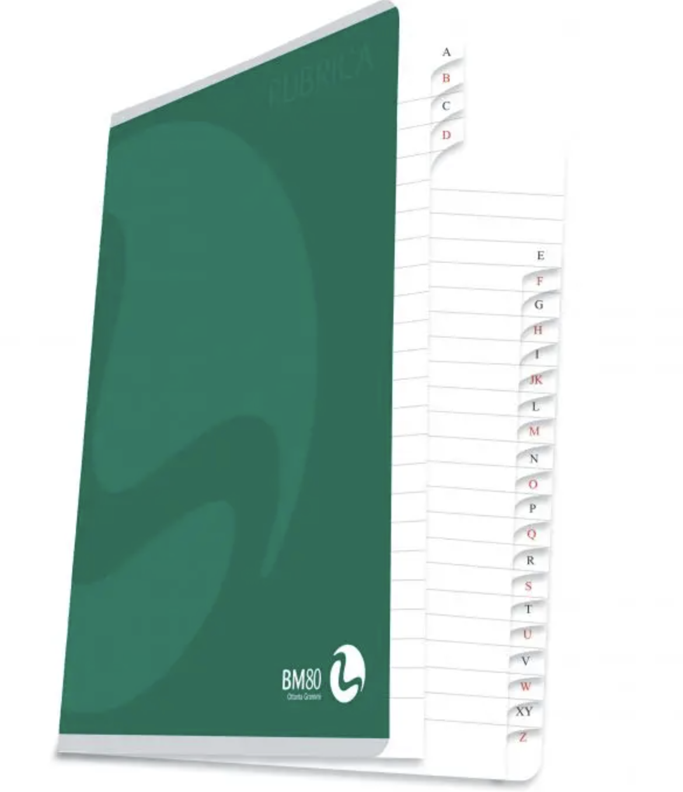

# Read alignment and SAM format

For mapping of 20-30 million reads to a genome that is around 3 billion bases long, we need a ultra fast aligner (that is, an algorithm for the read mapping) to perform the mapping. 


Before doing the mapping, we have to calculate an **index for the reference DNA sequence**. Each algorithm/program has its own specific method to produce the index.<br>
Like the index at the end of a book, an index of a large DNA sequence allows one to **rapidly find shorter sequences** embedded within it. Different tools use different approaches at genome/transcriptome indexing.

||
| :---:  |
||


<br/>

## Fast aligners
These tools can be used for aligning short reads to a reference genome or transcriptome. They can be much faster than traditional aligners like [**Blast**](https://blast.ncbi.nlm.nih.gov/Blast.cgi) but less sensitive and may have limitations about the read size.

* [**Bowtie**](http://bowtie-bio.sourceforge.net/index.shtml) is an ultrafast, memory-efficient short read aligner geared toward quickly aligning large sets of short DNA sequences (reads) to large genomes/transcriptomes. Bowtie uses a Burrows-Wheeler index. 
* [**Bowtie2**](http://bowtie-bio.sourceforge.net/bowtie2/index.shtml) is an ultrafast and memory-efficient tool for aligning sequencing reads to long reference sequences. It is particularly good at aligning reads of length 50 up to 100s or 1,000s to relatively long (e.g. mammalian) genomes. Bowtie 2 indexes the transcriptome with an FM Index. 
* [**BWA**](http://bio-bwa.sourceforge.net/) is a software package for mapping low-divergent sequences against a large reference genome, such as the human genome. BWA indexes the genome with an FM Index.
* [**GEM**](https://github.com/smarco/gem3-mapper) is a high-performance mapping tool for aligning sequenced reads against large reference genomes. In particular, it is designed to obtain best results when mapping sequences up to 1K bases long. GEM3 indexes the reference genome using a custom FM-Index design and performs an adaptive gapped search based on the characteristics of the input and the user settings. 

There is a standard format for the alignment called SAM format. 

## BAM/SAM format

The format Sequence Alignment/Map Format [**SAM format**](https://samtools.github.io/hts-specs/SAMv1.pdf) is plain text and can be displayed like a normal file:

```{bash}
pwd # check where you are located in the folder structure
cd .. # go up one level to the root of the project, if needed
mkdir alignment
cd alignment

wget https://biocorecrg.github.io/PhD_course_genomics_format_2021/data/H3K4me1.sam.gz
gunzip H3K4me1.sam.gz

more H3K4me1.sam 

@HD	VN:1.0	SO:unsorted
@SQ	SN:chr21	LN:46709983
@PG	ID:Bowtie	VN:1.2.3	CL:"/usr/local/bin/bowtie-align-s --wrapper basic-0 -S genome H3K4me1_chr21.fq.gz H3K4me
1.sam"
D00733:297:CBT52ANXX:6:2204:16979:89185	0	chr21	5010030	255	50M	*	0	0	TGGGATTACAGGTGTTAGCCACCA
CGTCCAGCTGTTAATTTTTATTTAAT	AAB@@1FC1DGGFEGGGGGGGGGE>FGGFDGGGGGEEDGGCGGGFGGGGF	XA:i:0	MD:Z:50	NM:i:0	XM:i:2
D00733:297:CBT52ANXX:6:1302:12939:54715	0	chr21	5010030	255	50M	*	0	0	TGGGATTACAGGTGTTAGCCACCA
CGTCCAGCTGTTAATTTTTATTTAAT	BBBBAF@FGGGGGGGGGGEGEGFFGGGGFBCFGCFGGEGCDBDFGFGGGF	XA:i:0	MD:Z:50	NM:i:0	XM:i:2
D00733:297:CBT52ANXX:6:1211:9390:70340	0	chr21	5010030	255	50M	*	0	0	TGGGATTACAGGTGTTAGCCACCA
CGTCCAGCTGTTAATTTTTATTTAAT	CCCCCGGGGGGGGGGGGGGGGGGGGGGGGGGGGGGGGGGGGGGFGCGGGG	XA:i:0	MD:Z:50	NM:i:0	XM:i:2
D00733:297:CBT52ANXX:7:2310:12330:36449	16	chr21	44253418	255	50M	*	0	0	ATTAAATAAAAATTAA
CAGCTGGACGTGGTGTCTAACACCTGTAATCCCA	GGGGGGGGGGGGGGGGGGGGGGGGGGGGGE=1GGGGGGGGGGGGGCCCCC	XA:i:1	MD:Z:31G18	NM:i:1	
XM:i:2
```

The first part (rows starting with the character **@**) is the header:

| Symbol|  |  |   
| :----: | :---- | :---- |
| **@HD** header line	| **VN:1.0** version of the SAM format|	**SO:unsorted** sorting order|
| **@SQ** reference sequence dictionary 	| **SN:chr21** sequence name|	**LN:46709983** sequence length|
| **@PG** program used|	**ID:Bowtie** **VN:1.2.3** version| **CL:"/usr/local/bin/bowtie-align-s --wrapper basic-0 -S genome H3K4me1_chr21.fq.gz H3K4me1.sam"** command line|

The rest is a read alignment. 

| Field|Value |   
| :----: | :---- |
|Query name 	|D00733:297:CBT52ANXX:6:2204:16979:89185|
|FLAG 	|0 * |
|Reference name 	|chr21|
|Leftmost mapping position (1-based)	|5010030|
|Mapping quality 	|255 **range from 0 to 255** |
|CIGAR string |50M *|
|Reference sequence name of the primary alignment of the mate |	= *same chromosome*|
|Position of the primary alignment of the mate| 	0|
|observed fragment length| 	0|
|Sequence |TGGGATTACAGGTGTTAGCCACCACGTCCAGCTGTTAATTTTTATTTAAT|
|Quality	|AAB@@1FC1DGGFEGGGGGGGGGE>FGGFDGGGGGEEDGGCGGGFGGGGF|

\* FLAG 0 means: read unpaired, mapped to the reference and mapped to the forward strand.<br>

The CIGAR string **50M** means all the 50 bases are equal to the reference (M).

The **BAM format** is a compressed version of the SAM format (plain text) and cannot thus be seen as a text. <br>
Converting SAM to BAM is really useful to save disk space and to quickly access the data: indeed, the BAM format can be sorted and indexed. <br>
To convert SAM to BAM, sort, index, etc. you can use the program: [**samtools**](http://samtools.sourceforge.net/). 


```{bash}
wget https://biocorecrg.github.io/PhD_course_genomics_format_2021/data/H3K4me1.bam

```

**Let's see how much space can be saved using BAM format instead of SAM using ls -lh command** <br>


**EXERCISE (in breakout rooms)**
<br>
* In the file H3K4me1.sam, count the number of aligned reads containing **exactly 40 A's** . 
 
 <br>
 
 TIPs: 
  1. Using **cat > test2** create a small file containing a few lines with 2, 3, 4, and 5 A's. Try your commands on this small file first to understands what is going on.
  2. Look up **man grep** for options to use grep with extended regular expressions.
  3. Look up **man grep** for basic regular expressions or this resource [https://www.codingame.com/playgrounds/218/regular-expressions-basics/repetitions](https://www.codingame.com/playgrounds/218/regular-expressions-basics/repetitions) 

<br>
