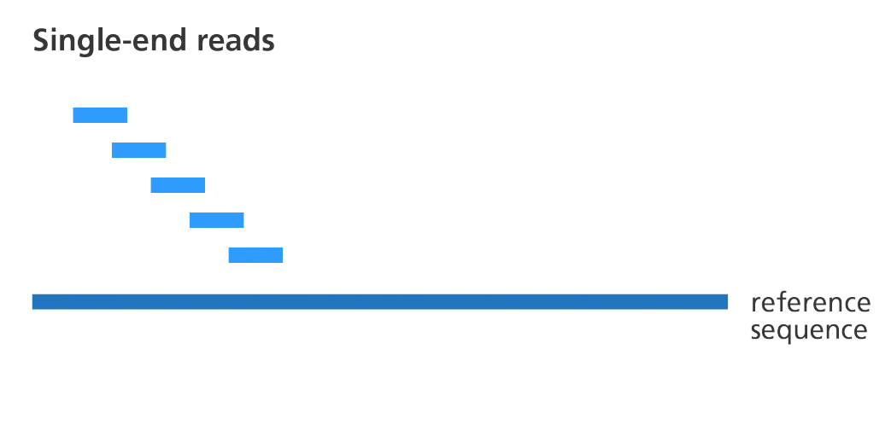

# Read alignment to a reference genome

Once sequencing reads quality is ensured, we can proceed with their mapping (aka, alignment) to a reference genome. It will allow us to know to which regions of the reference genome most of the reads aligned to.

|Mapping of short reads|
| :---:  |
||


<br>

Before doing the mapping, we need to retrieve information about a reference genome from a **public database**. <br>
The program which maps reads to a genome or transcriptome (called an **aligner**) needs a **FASTA file** of the reference genome (a file with an extension **.fa**).
<br>

## Public resources on genome sequences and annotations

* [GENCODE](https://www.gencodegenes.org/) contains an accurate annotation of the **human** and **mouse** genes derived either using manual curation, computational analysis or targeted experimental approaches. GENCODE also contains information on **functional elements**, such as protein-coding loci with alternatively splices variants, non-coding loci and pseudogenes.
* [Ensembl](https://www.ensembl.org/index.html) contains both automatically generated and manually curated annotations. They host different genomes and also **comparative genomics data** and **variants**. [Ensembl genomes](http://ensemblgenomes.org/) extends the genomic information across different taxonomic groups: bacteria, fungi, metazoa, plants, protists. Ensembl integrates also a genome browser.
* [UCSC Genome Browser](https://genome.ucsc.edu/) hosts information about different genomes. It integrates the GENCODE information as additional tracks.

<br>
We will use GENCODE for performing mapping to the human genome. <br> Let's retrieve the data that we will use.
<br>
In GENCODE, we will be using the version [v32 of the human genome](https://www.gencodegenes.org/human/release_32.html). 
<br>

We need two files:
* FASTA file for **Genome sequence, primary assembly (GRCh38)**.
* GTF file for **Comprehensive gene annotation (CHR)**

|GENCODE website|
| :---:  |
||


## FASTA formats
To speed up the mapping process, we already downloaded FASTA file for human v32 from GENCODE and extracted **only the information about chromosome 21**.<br>

Download it to the folder **db** of your project:

```{bash}
pwd # to check where you are in the folder structure
cd ../ # to go to the root of the project folder, if needed
mkdir db
cd db

wget https://biocorecrg.github.io/PhD_course_genomics_format_2022/data/Homo_sapiens.GRCh38.dna.chromosome.21.fa.gz
```

The genome is generally represented as a FASTA file (.fa file). Each chromosome sequence starts with a header row, starting with "**>**":

```{bash}
zcat Homo_sapiens.GRCh38.dna.chromosome.21.fa.gz | head -n 5

>chr21 dna:chromosome chromosome:GRCh38:21:1:46709983:1 REF
NNNNNNNNNNNNNNNNNNNNNNNNNNNNNNNNNNNNNNNNNNNNNNNNNNNNNNNNNNNN
NNNNNNNNNNNNNNNNNNNNNNNNNNNNNNNNNNNNNNNNNNNNNNNNNNNNNNNNNNNN
NNNNNNNNNNNNNNNNNNNNNNNNNNNNNNNNNNNNNNNNNNNNNNNNNNNNNNNNNNNN
NNNNNNNNNNNNNNNNNNNNNNNNNNNNNNNNNNNNNNNNNNNNNNNNNNNNNNNNNNNN
```

The size of the chromosome (46709983 bp) is already reported in the header, but we can check it using command **wc**.
<br> Let's first look at **wc** using our test file (created in the section "Fastq format"):

```{bash}
cat test
1
2
3
4
10
20
30
40

wc test
 8  8 20 test
```

**wc** outputs 3 numbers: the number of lines, the number of words, and the number of characters.


```{bash}
zcat Homo_sapiens.GRCh38.dna.chromosome.21.fa.gz | grep -v ">" | wc   

 778500  778500 47488483
```

Our combinations of commands is the following:
* unzipping the file to show the content to the stdout using **zcat**
* piping the output to the program **grep** for removing the part containing the header (check the -v option in grep, using **man grep**)
* counting the number of charachters using **wc**

Why the number of characters output by **wc** (47488483) is not equal to the number of base pairs (46709983)? <br>
Note, the difference:
```{bash}
char=$(zcat Homo_sapiens.GRCh38.dna.chromosome.21.fa.gz | grep -v ">" | wc -c)  
echo $char
47488483
 
echo $((char-46709983))
778500
```

That tells us that every line of the file contains one additional character, which we can see using command **cat -A** (to show special characters):

```{bash}
zcat Homo_sapiens.GRCh38.dna.chromosome.21.fa.gz | head -5 | cat -A
>21 dna:chromosome chromosome:GRCh38:21:1:46709983:1 REF$
NNNNNNNNNNNNNNNNNNNNNNNNNNNNNNNNNNNNNNNNNNNNNNNNNNNNNNNNNNNN$
NNNNNNNNNNNNNNNNNNNNNNNNNNNNNNNNNNNNNNNNNNNNNNNNNNNNNNNNNNNN$
NNNNNNNNNNNNNNNNNNNNNNNNNNNNNNNNNNNNNNNNNNNNNNNNNNNNNNNNNNNN$
NNNNNNNNNNNNNNNNNNNNNNNNNNNNNNNNNNNNNNNNNNNNNNNNNNNNNNNNNNNN$
```

This **$ character** stands for a new line character. How can we remove this character? <br>


There is a Linux program **tr** that allows to manipulate the content of files in a command line.
Let's look at its options using **man tr**.
Which option should we use to delete a character?


<br> Let's try it first with the test file:

```{bash}
cat test
1
2
3
4
10
20
30
40

cat test | wc
      8       8      20
      
cat -A test 
1$
2$
3$
4$
10$
20$
30$
40$

cat test | tr -d '\n'
123410203040

cat test | tr -d '\n' | wc
      0       1      12
      
     
```

Now, we can apply these commands to our big file:

```{bash}
zcat Homo_sapiens.GRCh38.dna.chromosome.21.fa.gz | grep -v ">" | tr -d '\n' | wc -c  

46709983
```

The flow of commands is the following:
* unzipping the file to show the content to the stdout using **zcat**
* piping the output to the program **grep** for removing the part containing the header (that starts with **>**) 
* removing the carriage returns using **tr**
* counting the number of characters using **wc**

<br>

**EXERCISE**

Download in the folder ./db the annotation file at https://biocorecrg.github.io/PhD_course_genomics_format_2022/data/annotation.gtf.gz  
 * What date of this file? (use command **more** to explore the file)
 * How many lines in this file?
 * How many lines in this file contain the word "HAVANA"?
 * How many characters the first line of the file contains?
 * How many characters the lines starting with # contain?
 
 <br>
