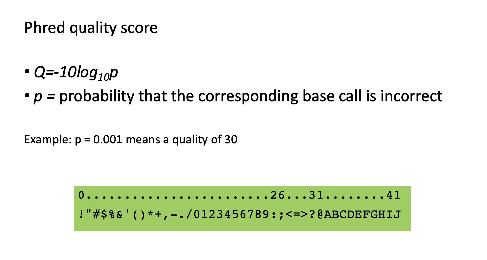

# FASTQ format for sequencing reads

Short (and long) sequencing reads coming from the high throughput sequencers are usually stored in **FASTQ** format (files with an extension **.fastq**).<br/>
This format contains the information about the sequence and the quality of each sequenced base. The quality encodes the probability that the corresponding base call is incorrect.
<br/>


The FASTQ format contains four rows per sequencing read:
* a header containing **@** as the first character, followed by: 
	* sequencer unique ID
	* run ID
	* flowcell ID
	* flowcell lane
	* tile number within the flowcell lane
	* x- and y- coordinates in within the tile.
* the sequence content
* a **spacer**
* the quality encoded using ASCII characters.

<br/>



<br/>

* Score = 10 (symbol '+') => probability of incorrect base call = 0.1 => base call accuracy = 90%
* Score = 20 (symbol '5') => probability of incorrect base call = 0.01 => base call accuracy = 99%
* Score = 30 (symbol '?') => probability of incorrect base call = 0.001 => base call accuracy = 99.9% - This is a commonly acceptable threshold for trimming reads for low-scored ends or average score of the read.
* Score = 40 (symbol 'I') => probability of incorrect base call = 0.0001 => base call accuracy = 99.99%

<br/>

Let's start with creating the folder for our project, using the command **mkdir**.
It is recommended to always use the date at the beginning of the folder name, in the format YYYY-MM-DD:
<br>

```{bash}
mkdir 2022-10-25-genomics_data_formats

# type cd 2[TAB] to autofill the folder name
cd 2022-10-25-genomics_data_formats
```

<br/>

It is also a good practice to write README.txt in the root of your project folder.

Let's use command **cat** to create a simple README.txt

```{bash}
cat > README.txt
Date: 25/10/2022
Author: ....
Project title: This is my first project.
```
<br>
Use the keys Enter and then Ctr-D to get out of cat.
<br>

Explore your new file using **more**.
To quit command **more**, use the key **Q** on the keyboard.<br/><br/>

<br>
We forgot to write down the goal of the project.
We can append a new line to an existing file using **cat** and redirection **>>**:

```{bash}
cat >> README.txt
Project goal: To learn genomics data formats and never forget to write README!
```

Use the keys Enter and then **Ctrl D** to get out of cat.


Explore your new file using **more**.

It seems we put the date using an ambiguous notation.
Let's correct this.
To edit the file we can use **nano editor** (this is the simplest editor available in any Linux OS).
```{bash}
nano README.txt
```

Use keys **CtrlI** and **O** plus **Enter** to write this file, and **Ctrl X** to exit the editor.
Now you can see this file in your folder, typing **ls**.
And read the file using command **more**.


<br/>

Download a **test dataset** by executing the command **wget**:

```{bash}
wget https://biocorecrg.github.io/PhD_course_genomics_format_2022/data/H3K4me1_chr21.fq.gz 
--2019-10-15 14:42:59--  https://biocorecrg.github.io/PhD_course/data/H3K4me1_chr21.fq.gz
Resolving biocorecrg.github.io (biocorecrg.github.io)... 185.199.109.153, 185.199.111.153, 185.199.110.153, ...
Connecting to biocorecrg.github.io (biocorecrg.github.io)|185.199.109.153|:443... connected.
HTTP request sent, awaiting response... 200 OK
Length: 17587112 (17M) [application/gzip]
Saving to: ‘H3K4me1_chr21.fq.gz’

100%[======================================================================================>] 17,587,112  37.7MB/s   in 0.4s   

2019-10-15 14:43:01 (37.7 MB/s) - ‘H3K4me1_chr21.fq.gz’ saved [17587112/17587112]`

```
<br>


Now, let's check the **size of the donwloaded file** (the file has an extension **gz** because it was archived using command **gzip**) using command **ls** with options **-l** (use a long listing format) and **-h** (with -l, print sizes in human readable format (e.g., 1K, 234M, 2G)):

```{bash}
ls -lh H3K4me1_chr21.fq.gz 

-rw-r--r-- 1 lcozzuto Bioinformatics_Unit 17M Oct 15 14:19 H3K4me1_chr21.fq.gz
```
<br/>

**EXERCISE**<br/>
* Download the **control file for this ChIP-seq experiment** at https://biocorecrg.github.io/PhD_course_genomics_format_2022/data/input_chr21.fq.gz <br>
* What is the size of the input file?
* Look up for the options of the command **ls** using the command **man ls**. 
* Which option in command **ls** allows to display files sorted by size? Run this command.
* Which option in command **ls** allows to display files sorted by size from smallest to largest? Run this command.
* Which option in command **ls** allows to display files sorted by the modification time? Run this command.
* How to display the files in the order of modification from th earliest to latest? Run this command.
* Create the folder **data** and move downloaded files there using **mv** command.
* Go to the folder **data** to see its content, using command **ls**.
* Write README.txt in ./data folder describing how you obtained the files.
**TIP**: To quit command **man**  use the key **Q** on the keyboard.
<br/>


Let's explore the fastq file using the **pipe** and the Linux commands **zcat**, **head**, **tail** and **more**.<br>

**A pipe (vertical bar, or key '|')** is a form of redirection (transfer of standard output to some other destination) that is used in Linux and other Unix-like operating systems to send the output of one command/program/process to another command/program/process for further processing.
<br>

Command **head** by default outputs the first 10 lines of the file; to output a specified number of lines, we can use the option **-n**:

```{bash}
zcat H3K4me1_chr21.fq.gz | head
zcat H3K4me1_chr21.fq.gz | head -n 4
```
<br/>

If you forgot to type pipe and want to stop the command from running type Ctr-C.

**WARNING**
Mac users cannot use **zcat** in this way. They need to use a slightly different syntax.

```{bash}
zcat < H3K4me1_chr21.fq.gz | head
```

or an alternative

```{bash}
gzip -c H3K4me1_chr21.fq.gz | head
```

<br>

**EXERCISE**<br>
* Explore the command **tail** using **man**.
* What are the first 5 character on the 7th line from the end of file H3K4me1_chr21.fq.gz?

<br>

While viewing the text file using **more**, use these controls:
* **Enter key**: to scroll down line by line.
* **Space bar**: To go to the next page.
* **b key**: To go back one page.


```{bash}

zcat H3K4me1_chr21.fq.gz | more
```


<br>

Let's check how many lines are in this file, using command **wc**:

```{bash}
zcat H3K4me1_chr21.fq.gz | wc -l 

2089260
```
<br>

Since the fastq files contains 4 lines per sequence (read), we can calculate the number of reads by **dividing the total number of lines in the file by 4**. <br> <br>

This can be done, using the **Linux shell variables (they are created using '=' and accessed using '$')** and **bash arithmetic commands** (see [https://www.shell-tips.com/bash/math-arithmetic-calculation/](https://www.shell-tips.com/bash/math-arithmetic-calculation/)):


```{bash}
echo $((10*10-5))


num=$(zcat H3K4me1_chr21.fq.gz | wc -l)
echo $num

2089260

$((2089260/4))

522315

$((num/4)); echo $num

522315
```
<br>

Another way to do arithmetic and manipulation with files in Linux is using the scripting language **AWK** (to learn AWK, refer to this tutorial [https://www.tutorialspoint.com/awk/index.htm](https://www.tutorialspoint.com/awk/index.htm)):

```{bash}
zcat H3K4me1_chr21.fq.gz | awk '{num++} END{print num}'

2089260

zcat H3K4me1_chr21.fq.gz | awk '{num++} END{print num/4}'

522315
```
<br>

Also, because the header of each read contains the name of the sequencing machine, which is **@D00733** in this file, we can count the number of reads by counting header lines. <br>
To do so, we first extract header lines containing the name of the machine using command **grep** (caret sign '^' specifies the begining of the line):

```{bash}
zcat H3K4me1_chr21.fq.gz | grep "^@D00733" | wc -l	
```

<br>

To extract **only sequences**, you can proceed using commands **paste** and **cut**.<br>

To understand the commands output, let's create a file "test", using command **cat**: 

```{bash}
cat > test
```

Start typing 8 rows of numbers:
```{bash}
1
2
3
4
10
20
30
40
```
When finished typing, close the file, using **Ctrl + D** key combination.
<br>
<br>
Now you can examine the test file and look at what **paste** and **cut** do:

```{bash}
cat test
cat test | paste - - - - 
cat test | paste - - - - | cut -f2

cat test | paste - - -
cat test | paste - - - | cut -f3
```

Now, let's use these commands to extract sequences from fastq file and redirect the output (using **>**) to a newly created file "seq.txt":

```{bash}
zcat H3K4me1_chr21.fq.gz | paste - - - - | cut -f2 > seq.txt

head seq.txt
more seq.txt
```
Here, command **paste**, used this way, **combines N consecutive lines into one line separated by TAB (\t)**. Thus, we obtain **one line per read**.<br/>

We can then more easily manipulate the **sequences** themselves.
<br><br>

**EXERCISE**<br>
 * How many lines and reads are in the file with the input data?
 * Do it using **paste** and **cut** and then **grep** and **wc**.

<br><br>


