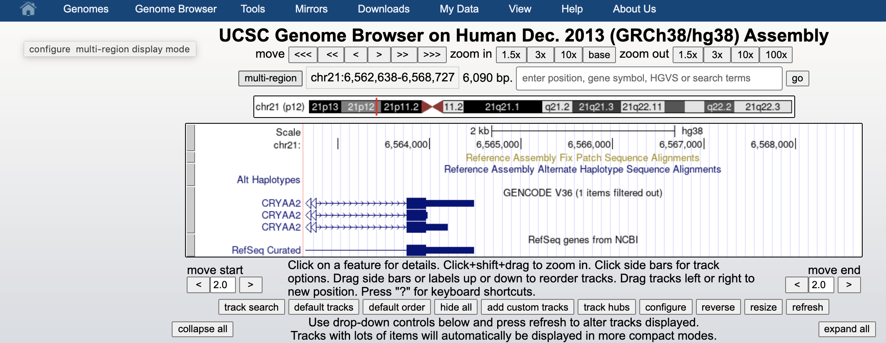
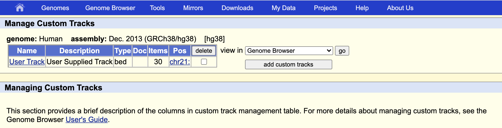
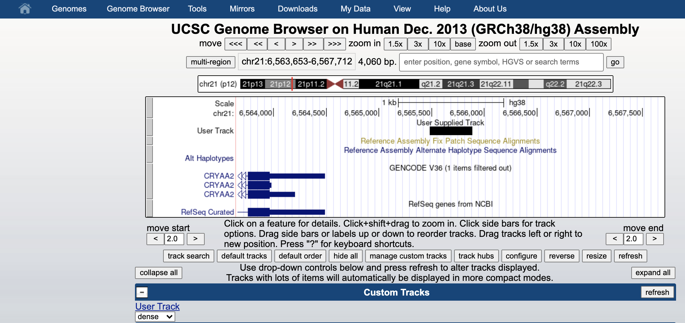
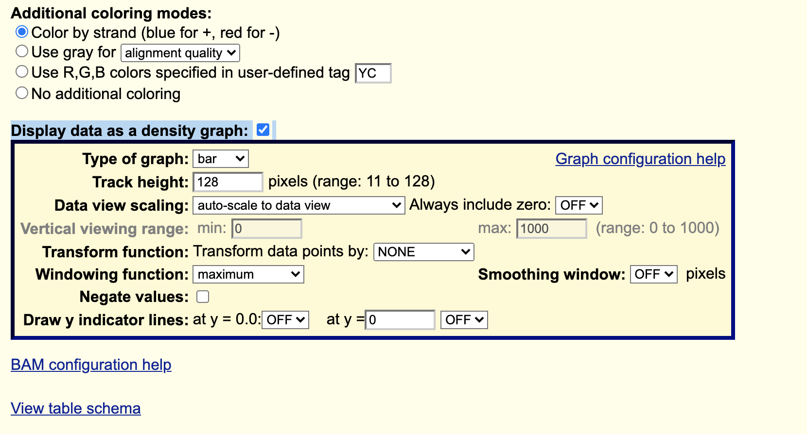
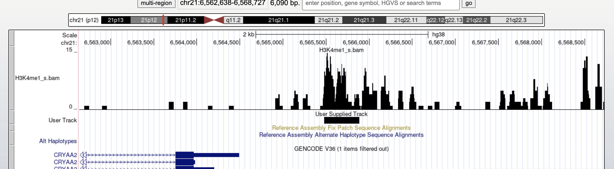

# Genome Browsers
The genome browsers like [UCSC Genome Browser](https://genome.ucsc.edu/) and [Ensembl](https://www.ensembl.org/index.html) allow to read and display a number of features, such as genomic intervals in different formats.
<br>
For example, you can load BED and GTF files and display them in the genomic context. So you can know where a ChIP-seq peaks are located in the genome.
<br>

Let's first convert our 9-field bed file in a more standard 6-field one:


```{bash}
cut -f 1-6 H3K4me_peaks.narrowPeak > H3K4me_peaks.bed
```
The program **cut** allows to extract columns  using a list or intervals. <br>
**NOTE**: However, you cannot change the order, e.g., ```cut -f 3,2``` (correct: ```cut -f 2,3```), or to use the same column more than once. 
Try these options!

## Uploading to UCSC genome browser

We can visualize the human genome at the UCSC Genome Browser (of the same hg38 assembly we used throught the above analysis) using [this link](https://genome-euro.ucsc.edu/cgi-bin/hgTracks?db=hg38&lastVirtModeType=default&lastVirtModeExtraState=&virtModeType=default&virtMode=0&nonVirtPosition=&position=chr1%3A11102837%2D11267747&hgsid=275956382_Pt8xtCr7lqwBvLFKVWmHQ2FaYs8Q).

We can upload our bed file by clicking on **add custom tracks** button, just below the picture.
<br>




Then we can either upload our file or cat it and copy paste in the window. Then you click on **submit** and **go** to go to the genome browser.
<br>



You can see it as black bar in the genome browser.

<br>




You can also display aligned sequences, but you need to place your sorted and indexed bam files in a web-server. Then you can just paste the corresponding web-link into the same **custom track** space to let the browser directly fecth the needed informations on the fly.

Copy paste this link into the **custom track**. This is the sorted version of our alignment, hosted in the github web-server.

```{bash}
https://biocorecrg.github.io/PhD_course_genomics_format_2022/data/H3K4me1_s.bam
```

In the same place we also hosted the index, called **H3K4me1_s.bam.bai**. When you don't specify it, the browser will automatically look for the index just adding **.bai** ad the end of the link we provide.


Once submitted let's change the display to **Display Mode** -> **FULL** and click the checkbox **Display data as a density graph**.




You will see the coverage of your mapped reads together with the called peaks.




