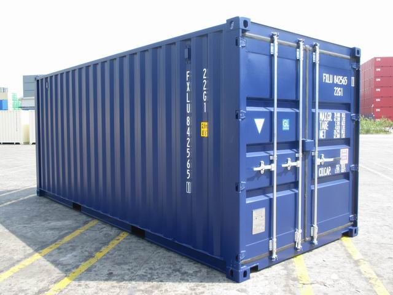
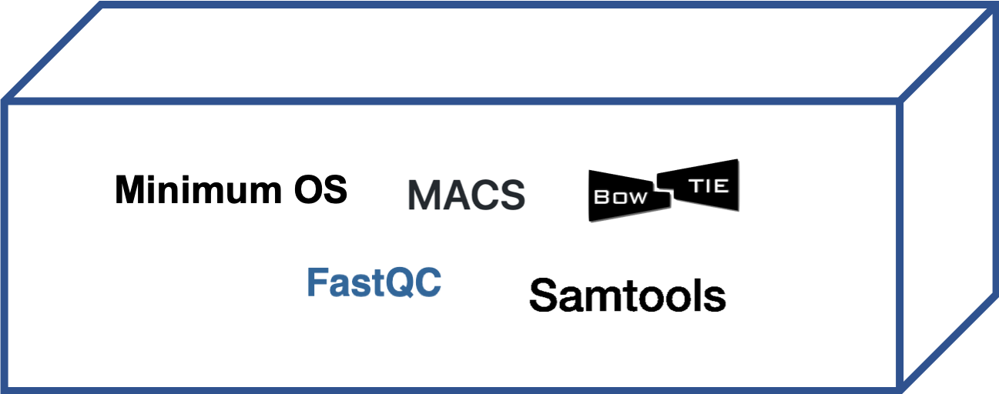

# Basic concepts on Linux containers

|A real container|
| :---:  |
||

During this course we will use a number of tools that are stored within a [**Linux container**](https://en.wikipedia.org/wiki/LXC) that can be thought as a minimal **virtual environment** and used in any Linux-compatible machine. 
<br>
Using containers allows researchers to save time and resources related to the installation of tools and libraries. It also improves the reproducibility of the analysis, since you will use the same exact environment used the previous time.
<br>
In order for us to work with exactly the same tools (and the same version of those tools) during the course, we created a [**Docker**](https://www.docker.com/) image from [this Dockerfile](https://github.com/biocorecrg/PhD_course/blob/master/Dockerfile), and uploaded it in [DockerHub](https://cloud.docker.com/u/biocorecrg/repository/docker/biocorecrg/phd2019:0.1).

This image can be downloaded and used on computers running Linux/Mac OS or can be converted into a [**Singularity**](https://www.sylabs.io/docs/) image, another Linux container technology which we will be using in this course.

The Singularity image is a simple file that can be accessed by the program **singularity** for executing any software installed **within that image**. <br>

|Our Linux Container|
| :---:  |
||


<< CAN WE ADD THIS AS A DEFAULT IN THE BASHRC??? IT CAN BE REALLY COMPLEX >>
To avoid a problem with everyone using the same tmp file on the cluster, which has a limited size, designate your current working directory as a temporary folder for singularity:

```{bash}
SINGULARITY_LOCALCACHEDIR=$PWD
export SINGULARITY_LOCALCACHEDIR
```
<<END>>


The following command creates the **Singularity** image from the **Docker** image:

```{bash}
singularity pull phd2019-0.1.simg docker://biocorecrg/phd2019:0.1
```

  
  << CAN WE ADD THIS AS A DEFAULT IN THE BASHRC??? IT CAN BE REALLY COMPLEX >>

The image can be accessed this way (here we are accessing the help page of the bowtie aligner):

```{bash}
singularity exec -e $PWD/phd2019-0.1.simg bowtie --help
```
  
For simplifying the usage of the Singularity image, we are storing the command in the variable **RUN*:

```{bash}
export RUN="singularity exec -e $PWD/phd2019-0.1.simg"
$RUN bowtie --help
```

If you are a CRG user with an access to the CRG cluster you can access the image as (no need to **pull** it from the Docker hub):

```{bash}
export RUN="singularity exec -e /db/images/phd2019-0.1.simg"
$RUN bowtie --help
```
<<...>>

If you want to learn more about Linux containers, visit the materials of the course we gave in the past [https://github.com/biocorecrg/containers-course](https://github.com/biocorecrg/containers-course) and stay tuned for the next online courses.

Starting from Windows 10 you can install Docker and run a Linux distribution even in a Windows environment. You can follow the instructions [here](https://ubuntu.com/tutorials/windows-ubuntu-hyperv-containers#1-overview)


<br>
