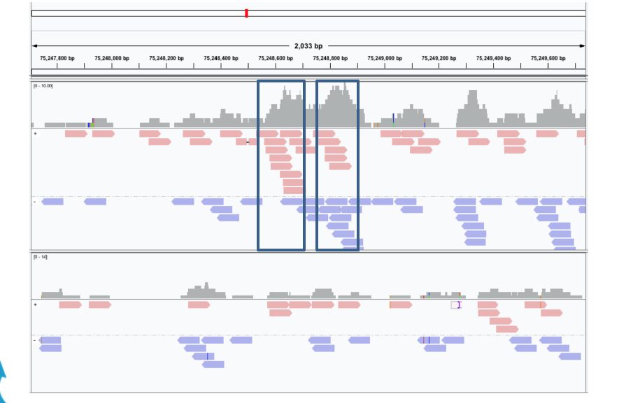
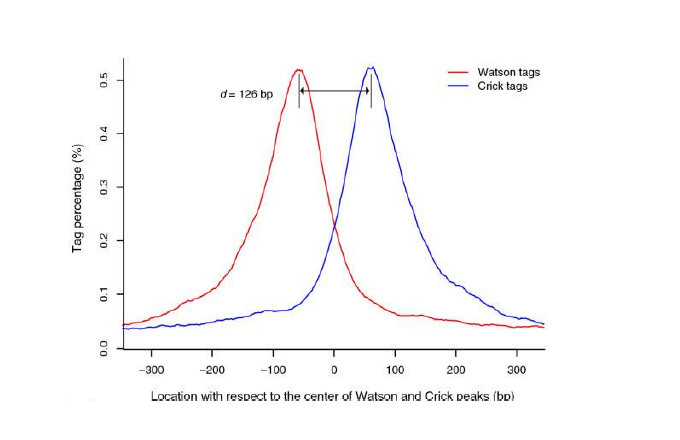

# Peak Calling and BED format

Peak calling is the method used to detect regions of the genome **enriched** in mapped reads. Those regions are called **peaks**.<br>
In brief, the genome is scanned looking for regions where the number of mapped reads is higher than expected by random picking. <br>
For avoiding false positives, a number of measures are taken such as the **removal of PCR artifacts** and the **detection of "paired peaks"** that are a diagnostic of good peaks. 



There are a number of tools available for doing peak calling, one of the most popular being [MACS](https://github.com/macs3-project/MACS).<br>
For the detailed description about the MACS algorithm see [the original paper](https://genomebiology.biomedcentral.com/articles/10.1186/gb-2008-9-9-r137) and [this course](https://hbctraining.github.io/Intro-to-ChIPseq/lessons/05_peak_calling_macs.html).<br>

The ChIP-Seq reads is normally less than 100 bases but it covers only the ends of the ChIP fragments that is normally longer (between 200 and 400 bps dependings on the sonication size). <br> 
Since ChIP-DNA fragments are equally likely to be sequenced from both 5' and 3' ends, the read density around a true binding site should show two peaks, one at the 5' and one at 3'. MACS takes advantage of this bimodal pattern to empirically model the **fragment size d** and shifts all reads **d/2** toward the 3' ends. 

|MACS|
| :---:  |
||
|Zhang Y et al. Model-based analysis of ChIPSeq (MACS). Genome Biol. 2008;9(9):R137.|


MACS can be easily used either for the ChIP sample alone, or along with a control sample which increases specificity of the peak calls.<br> In the latter case, a **sample** (or, treatment) is immunoprecipitated, while a **control**, is not. <br>

MACS then slides across the genome using a window size of 2d to find candidate peaks, estimates for each peak the probability to be found randomly in the local background, and calculates the adjusted p-values corrected for multiple comparison using the Benjamini-Hochberg correction. <br>

Let's look at one of the output files of MACS, the file **H3K4me_peaks.xls**.
First let's create the folder to store data on peaks.

```
pwd 
cd ..
mkdir peaks
cd peaks

wget https://biocorecrg.github.io/PhD_course_genomics_format_2021/data/H3K4me_peaks.xls


more H3K4me_peaks.xls
# This file is generated by MACS version 2.2.4
# Command line: callpeak -t H3K4me1.bam -c input.bam -g 46709983 -n H3K4me
# ARGUMENTS LIST:
# name = H3K4me
# format = AUTO
# ChIP-seq file = ['H3K4me1.bam']
# control file = ['input.bam']
# effective genome size = 4.67e+07
# band width = 300
# model fold = [5, 50]
# qvalue cutoff = 5.00e-02
# The maximum gap between significant sites is assigned as the read length/tag size.
# The minimum length of peaks is assigned as the predicted fragment length "d".
# Larger dataset will be scaled towards smaller dataset.
# Range for calculating regional lambda is: 1000 bps and 10000 bps
# Broad region calling is off
# Paired-End mode is off

# tag size is determined as 50 bps
# total tags in treatment: 514197
# tags after filtering in treatment: 201517
# maximum duplicate tags at the same position in treatment = 1
# Redundant rate in treatment: 0.61
# total tags in control: 612920
# tags after filtering in control: 421614
# maximum duplicate tags at the same position in control = 1
# Redundant rate in control: 0.31
# d = 276
# alternative fragment length(s) may be 276,300 bps
chr	start	end	length	abs_summit	pileup	-log10(pvalue)	fold_enrichment	-log10(qvalue)	name
21	6565481	6565885	405	6565634	22.00	7.98323	3.66432	3.26622	H3K4me_peak_1
21	8426561	8427181	621	8426758	35.00	5.64064	2.27604	2.09468	H3K4me_peak_2
21	8433166	8433530	365	8433248	30.00	6.48973	2.65288	2.49481	H3K4me_peak_3
21	8438082	8438492	411	8438329	31.00	7.12466	2.77893	2.84380	H3K4me_peak_4
--More--(42%)
```
<br>
Another output file is **H3K4me_peaks.narrowPeak**, which, as you can see contains the information only about peaks. This is a BED file.

```{bash}
wget https://biocorecrg.github.io/PhD_course_genomics_format_2021/data/H3K4me_peaks.narrowPeak

more H3K4me_peaks.narrowPeak
21	6565480	6565885	H3K4me_peak_1	32	.	3.66432	7.98323	3.26622	153
21	8426560	8427181	H3K4me_peak_2	20	.	2.27604	5.64064	2.09468	197
21	8433165	8433530	H3K4me_peak_3	24	.	2.65288	6.48973	2.49481	82
21	8438081	8438492	H3K4me_peak_4	28	.	2.77893	7.12466	2.84380	247
```

<br>

## BED format

This tab-separated text format is called **Browser Extensible Data** [(BED)](http://genome.ucsc.edu/FAQ/FAQformat#format1) and is normally contains 3, 6 or 12 columns. <br>

Here is the description of each column:

| Column number | Column name | Details |
| ----: | :---- | :---- |
| 1 | chrom | name of the chromosome or scaffold |
| 2 | chromStart | The starting position of the feature in the chromosome or scaffold. The first base in a chromosome is numbered 0 |
| 3 | chromEnd | The ending position of the feature in the chromosome or scaffold |
| 4 | name |  Defines the name of the BED line |
| 5 | score | A score between 0 and 1000 |
| 6 | strand | Defines the strand. Either "." (=no strand) or "+" or "-" |
| 7 | thickStart | The starting position at which the feature is drawn thickly |
| 8 | thickEnd | The ending position at which the feature is drawn thickly |
| 9 | itemRgb | An RGB value of the form R,G,B (a color code) |
| 10 | blockCount | The number of blocks (exons) in the BED line |
| 11 | blockSizes | A comma-separated list of the block sizes |
| 12 | blockStarts | A comma-separated list of block starts |

In the case of our **narrowPeak** file, the first six fields correspond indeed to the first six fields of a BED file, while the remaining ones are MACS-specific columns:

| Column number | Column name | Details |
| ----: | :---- | :---- |
| 7 | fold_enrichment | fold enrichment for the region |
| 8 | -LOG10(pvalue) | pvalue (-log10) |
| 9 | -LOG10(qvalue) | qvalue (i.e. false discovery rate) (-log10) |
| 10 | dist summit | The distance between the summit of the peak and the start |

More on MACS output files can be found [here](https://github.com/taoliu/MACS#output-files).<br>

Let's count how many peaks were found:

```
wc -l H3K4me_peaks.narrowPeak

```

We can check how many peaks have q-value (in column #9) larger than 0.01 (i.e., -log10(0.01) = 2). 

```
awk -F"\t" '{if ($9>=2) print}' H3K4me_peaks.narrowPeak | wc -l 
28
```
<br>

**EXERCISE** <br>
 * How many peaks in the file H3K4me_peaks.narrowPeak have fold enrichment larger than 5 ?

 
 
 <br>

