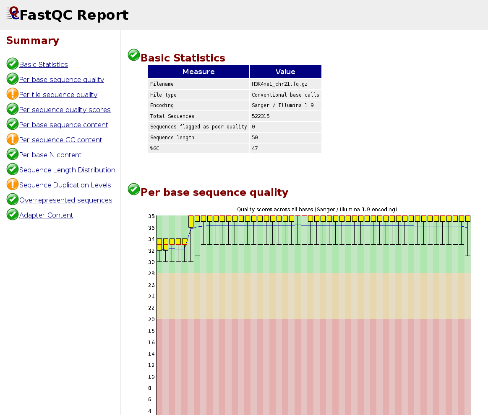
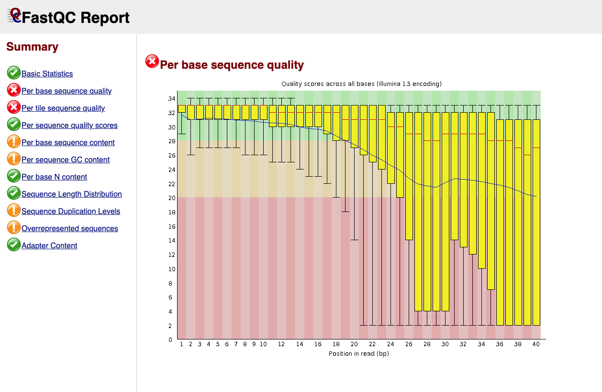

## QC of sequencing reads

To assess the quality of sequencing data, we will use the program [**FastQC**](https://www.bioinformatics.babraham.ac.uk/projects/fastqc/).

**FastQC** calculates statistics about the **composition** and **quality** of raw sequences (raw = as they come out of the sequencer).


FastQC outputs two files:

* H3K4me1_chr21_fastqc.html
* H3K4me1_chr21_fastqc.zip

<br>
Let's create in the root of the project the folder **fastqc**, download there the html file and display the results in an Internet browser; e.g., Firefox, using command **firefox**:


 
```{bash}
cd .. # make sure to move up in the root of the project folder
mkdir fastqc
cd fastqc

wget https://biocorecrg.github.io/PhD_course_genomics_format_2021/data/H3K4me1_chr21_fastqc.html

firefox H3K4me1_chr21_fastqc.html
```

**NOTE**. If you don't have X11 forwarding, don't worry. Just copy paste this link in your browser:

```{bash}
 https://biocorecrg.github.io/PhD_course_genomics_format_2021/data/H3K4me1_chr21_fastqc.html
```



<br/>

Below is an example of a poor quality dataset. As you can see, the average quality drops dramatically towards the 3'-end of sequencing reads.



<br>
